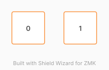

# ZMK Configuration for PageTurner

*Generated by Shield Wizard for ZMK*



Download compiled firmware from the Actions tab. <https://zmk.dev/docs/user-setup#installing-the-firmware>

Edit your keymap <https://zmk.dev/docs/keymaps>.
User keymap is located at [`config/pageturner.keymap`](config/pageturner.keymap).

-----

<details>
<summary>
Shield Wizard Debug Information
</summary>

In case of broken configuration, here is the Shield Wizard internal data used to generate this configuration:

Commit: 1537a37ff5e7378350dea3139aaebbe556cbf80d

```json
{"name":"PageTurner","shield":"pageturner","dongle":false,"modules":[],"layout":[{"id":"01KVW3Y20KZHRMDV85JD902Q8E","part":0,"row":0,"col":0,"w":1,"h":1,"x":-1.5,"y":0,"r":0,"rx":0,"ry":0},{"id":"01KVW3Z50A4NBBR8Z5J0CZ3MHK","part":0,"row":0,"col":1,"w":1,"h":1,"x":0,"y":0,"r":0,"rx":0,"ry":0}],"parts":[{"name":"unibody","controller":"nice_nano_v2","pins":{"d6":{"usage":"kscan","kscan":"01KVW47J5A7NKSY7KCZDZ4EY84","role":"input"},"d8":{"usage":"kscan","kscan":"01KVW47J5A7NKSY7KCZDZ4EY84","role":"input"}},"kscans":[{"kind":"direct","id":"01KVW47J5A7NKSY7KCZDZ4EY84","mode":"gnd"}],"keys":{"01KVW3Y20KZHRMDV85JD902Q8E":{"input":"d6"},"01KVW3Z50A4NBBR8Z5J0CZ3MHK":{"input":"d8"}},"encoders":[],"buses":{}}]}
```

</details>
